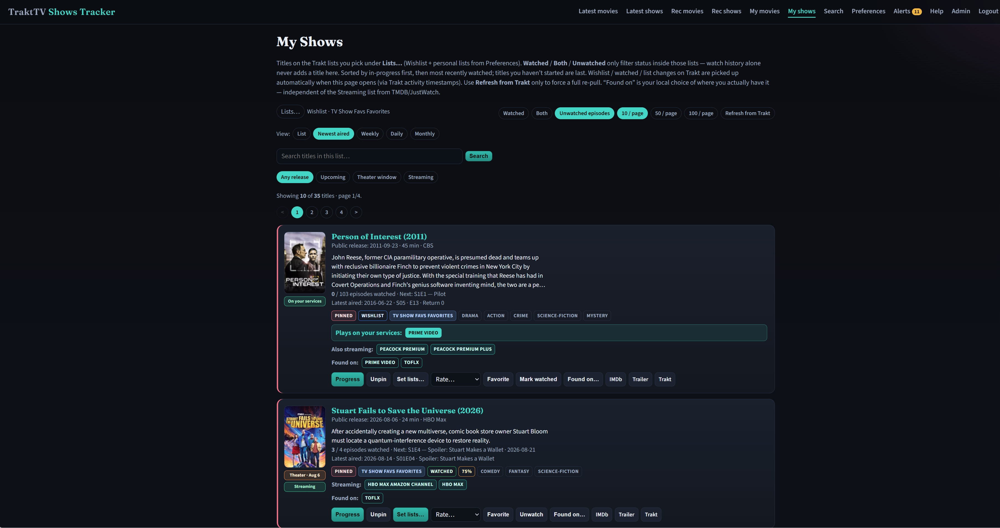
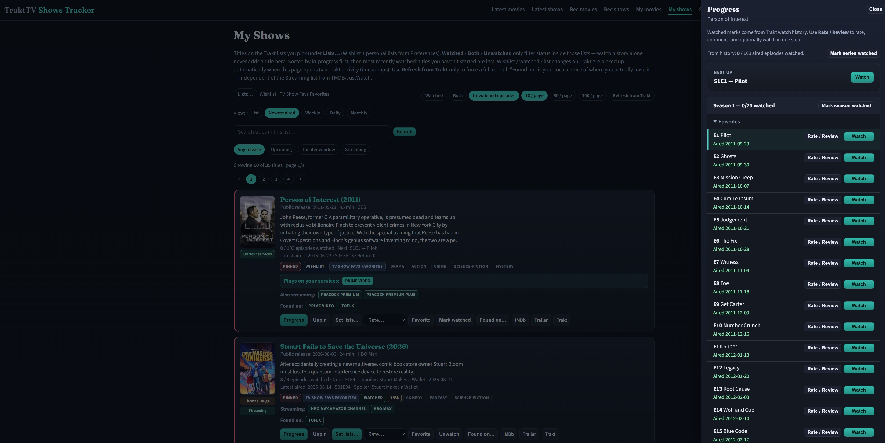
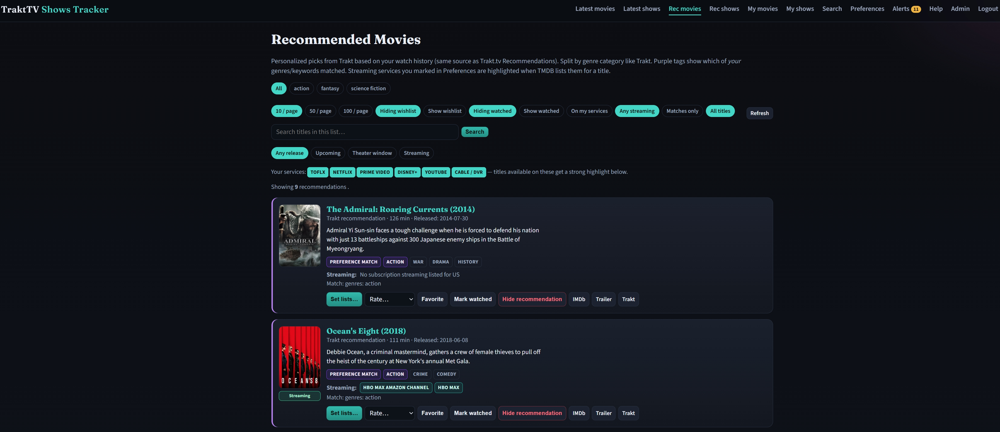
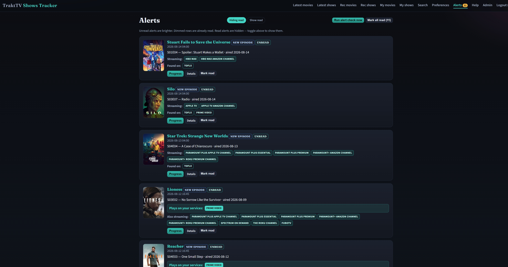

# TraktTV Shows Tracker

Web app to discover newly listed movies/shows on Trakt, match them to your streaming preferences, sync watchlist/watched/progress with TraktTV, and keep local extras (found-on services, review markers, release alerts).

**Copyright (c) 2026 Nir Melamoud.** Licensed under the [PolyForm Noncommercial License 1.0.0](LICENSE). You may use, modify, and share this project for personal, educational, and other non-commercial purposes. **Commercial use requires written permission** from the copyright holder — [request a license via GitHub](https://github.com/melamoud).

Built with **Python Flask + SQLite**, following the same operational patterns as AudioBooksReview (HTTPS runner, CSRF, help docs, admin/user route split).

## Quick start

1. Copy `.env.example` → `.env` and set Trakt API keys + `ADMIN_TRAKT_USERNAMES`
2. Double-click or run `run.bat`
3. Open `https://localhost:8300` and **Login with TraktTV**
4. Stop with `stop.bat`

Details: [docs/SETUP.md](docs/SETUP.md)

## Documentation

- [Original prompt](docs/ORIGINAL_PROMPT.md)
- [Architecture](docs/ARCHITECTURE.md)
- [Setup](docs/SETUP.md)
- [Deployment](docs/DEPLOYMENT.md) (`tvtracker.melamoud.com`)
- [Changes](docs/CHANGES.md)
- In-app **Help** menu (`docs/help/user` and `docs/help/admin`)
- [Android app](android/README.md) — My Shows / My Movies / Search / Alerts / Progress

## Main features

- Login with Trakt (friends/family each use their own Trakt account)
- Latest movies & shows (10/50/100), preference highlights, watchlist/watched, review marker
- Read-only **Streaming:** (TMDB/JustWatch) vs local multi-select **Found on…**
- Preferences: streaming services (defaults + custom + admin approval), genres/keywords
- My movies / My shows (default Wishlist); series progress with Trakt write-back
- In-app release alerts when a title appears on streaming
- Admin: users, services, manual release check, help

## Screenshots

### My Shows (web)

Lists from Trakt (Wishlist + personal lists), unwatched-episode filter, newest-aired sort, streaming highlights, pin / lists / rate / watch.



### Series progress (web)

Per-season episode list with next-up, watch / unwatch, and Rate / Review — writes back to Trakt.



### Recommended movies (web)

Personalized Trakt picks, genre tabs, preference-match tags, and “plays on your services.”



### Alerts (web)

Release / new-episode / streaming alerts for titles in your lists. Unread badge, mark read, jump to Progress.



### My Shows (Android)

Same server and Trakt login on the phone: My Shows / My Movies / Search / Alerts, with Progress and Watch on each card.


## Tests

```bat
.venv\Scripts\pytest.exe -q
```

## License

Copyright (c) 2026 Nir Melamoud. All rights reserved.

This repository is **not** MIT/Apache/GPL open source. It uses the [PolyForm Noncommercial License 1.0.0](LICENSE):

- Allowed without asking: personal hobby use, private study, and use by schools, charities, and similar non-commercial organizations
- **Not allowed without consent:** selling the software, using it in a paid product or service, or any other commercial purpose

To use this project commercially, contact [github.com/melamoud](https://github.com/melamoud) and wait for a written license.
