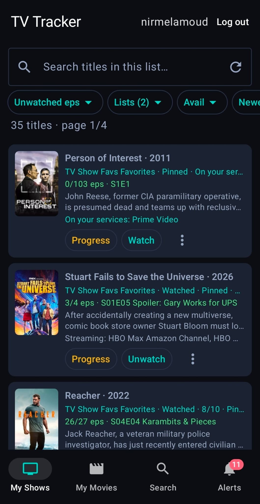

# Android app

Native Kotlin client for TraktTV Shows Tracker. Sideload an APK first; Play Store packaging comes later.

The app talks to `https://tvtracker.melamoud.com:8300` the same way the AudioBooks Review app talks to its server: HTTPS, bundled origin cert, cookie session. Login is **Trakt OAuth** (not a local password).

**Restart the Flask server** after pulling `/api/v1` changes or the app will get HTTP 404.

Login diagnostics: Android logcat tags `TVTrackerAuth` and `TVTrackerHttp`; server `logs/app.log` lines tagged `[ANDROID-API]`.

## Screens (v1)

- **My Shows / My Movies** — list + newest-aired, status filters, Lists…, availability chips, in-list title search, pin / lists / Found on / watched / rate / favorite. Filters are remembered on the server; **Found on** chips open the service. Tap a card for the title page
- **Search** — Trakt-wide search; add to lists; hide watched / already-listed (remembered); actor search from a title’s cast; **Found on…** in the ⋮ menu
- **Alerts** — unread badge, mark read, Progress on episode/season alerts; **Found on** chips open the service; tap a card for the title page
- **Title page** — same actions as the website (lists, rate, favorite, review, watched, Found on, links, cast)
- **Progress** — watch / unwatch episodes and seasons
- **Home-screen widget** — Shows / Movies / Alerts (switch in the header). Scrollable list, mark watched with confirm, tap a row to open the title in the app. Resize for more rows.

Latest and Recommended screens are not in this build.



## Open in Android Studio

1. Install [Android Studio](https://developer.android.com/studio) (it includes JDK 17).
2. **File → Open** the `android/` folder (not the Python repo root).
3. Let Gradle sync. Install the Android SDK (API 35) if prompted.
4. Run on a phone or emulator, or build an APK (below).

## JDK 17 (this project only)

Android Gradle Plugin needs JDK 17. A copy lives at `D:\dev\jdk-17` so the system Java 25 install and `JAVA_HOME` stay unchanged.

- **Command line:** `android\gradlew.bat` uses `D:\dev\jdk-17` when that folder exists (`setlocal`, so it does not leak into other programs).
- **Android Studio:** **Settings → Build, Execution, Deployment → Build Tools → Gradle → Gradle JDK** → pick `D:\dev\jdk-17` (not the default 25). Do not change the OS `JAVA_HOME` variable.

## Build a debug APK

```bat
cd android
gradlew.bat assembleDebug
```

The APK is `android/app/build/outputs/apk/debug/TVTracker-v1.0.0-debug.apk`.

## Install on a phone

1. Send the APK (Drive, chat, USB).
2. On the phone: open the file → **Install**. Allow **Install unknown apps** for the app you used to open the APK.
3. Tap **Login with TraktTV**, authorize in the browser, and return to the app.

## License

Copyright (c) 2026 Nir Melamoud. Same terms as the rest of this repository: [PolyForm Noncommercial License 1.0.0](../LICENSE). Commercial use requires written permission.
